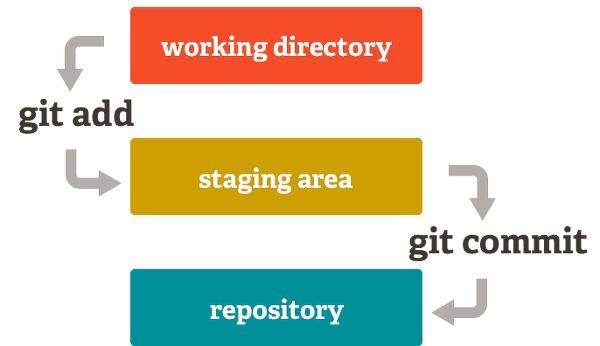

# MyExample

## Repository for Practice

|제목|내용|설명|
|------|---|---|
|이름|송윤석|테스트|
|기술|Github|practice|
# - Github 연습장 만들기
### 설계도

### 참고 동영상
<iframe width="1024" height="680" src="https://www.youtube.com/embed/Fley6IFhlC8" title="Git, Github의 개념과 초간단 깃허브 코드 올리기" frameborder="0" allow="accelerometer; autoplay; clipboard-write; encrypted-media; gyroscope; picture-in-picture; web-share" referrerpolicy="strict-origin-when-cross-origin" allowfullscreen></iframe>

### reference
1. [깃허브](https://github.com)
